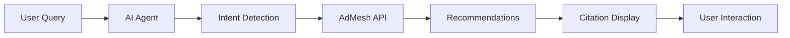
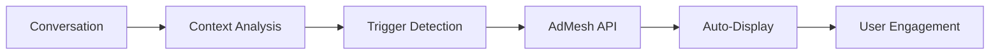
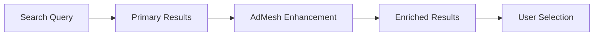

# AI Agent Integration Overview

AdMesh is specifically designed for AI applications, chatbots, and intelligent agents. This guide covers how to integrate AdMesh into various AI platforms and create intelligent recommendation systems.

## Why AdMesh for AI Agents?

### 🤖 AI-First Design
- **Intent Detection** - Automatically understand user queries
- **Contextual Understanding** - Recommendations based on conversation context
- **Natural Language Processing** - Works with conversational interfaces
- **Citation-Based Display** - Show recommendations as numbered references

### 🔄 Seamless Integration
- **Multiple SDKs** - Python, TypeScript, and React UI components
- **Async Support** - Non-blocking operations for real-time chat
- **Error Handling** - Graceful fallbacks for AI applications
- **Auto-Recommendations** - Trigger suggestions without user input

## Integration Patterns

### 1. Conversational AI Pattern

Perfect for chatbots and AI assistants that need to provide product recommendations within conversations.



**Example Flow:**
1. User asks: "I need a CRM for my startup"
2. AI agent detects intent: `best_for_use_case`
3. AdMesh returns relevant CRM recommendations
4. AI displays recommendations as citations in response

### 2. Auto-Recommendation Pattern

AI applications that automatically suggest products based on conversation context without explicit user requests.



**Example Flow:**
1. User discusses business challenges
2. AI detects relevant product categories
3. AdMesh automatically provides suggestions
4. Recommendations appear as floating widgets

### 3. Enhanced Search Pattern

Enhance existing search and discovery features with AI-powered recommendations.



## Supported AI Platforms

### 🤖 ChatGPT Plugins
Integrate AdMesh into ChatGPT plugins for product recommendations:

```python
import openai
from admesh import Admesh

def chatgpt_plugin_handler(user_query):
    # Get ChatGPT response
    gpt_response = openai.ChatCompletion.create(
        model="gpt-4",
        messages=[{"role": "user", "content": user_query}]
    )
    
    # Check if response mentions products/tools
    if contains_product_intent(gpt_response.choices[0].message.content):
        # Get AdMesh recommendations
        admesh_client = Admesh()
        recommendations = admesh_client.recommend.get_recommendations(
            query=user_query,
            format="auto"
        )
        
        # Enhance response with recommendations
        return enhance_with_citations(gpt_response, recommendations)
    
    return gpt_response
```

### 🧠 Claude Integration
Integrate with Anthropic's Claude for intelligent recommendations:

```python
import anthropic
from admesh import AsyncAdmesh

async def claude_with_recommendations(user_query):
    # Get Claude response
    claude = anthropic.Anthropic()
    claude_response = await claude.messages.create(
        model="claude-3-sonnet-20240229",
        messages=[{"role": "user", "content": user_query}]
    )
    
    # Analyze for product recommendations
    if should_recommend_products(claude_response.content):
        admesh_client = AsyncAdmesh()
        recommendations = await admesh_client.recommend.get_recommendations(
            query=user_query,
            format="auto"
        )
        
        return add_product_citations(claude_response, recommendations)
    
    return claude_response
```

### 🎭 Replica.io Integration
Perfect for AI companions and character-based interactions:

```typescript
import { AdMeshAutoRecommendationWidget } from 'admesh-ui-sdk';

function ReplicaAIWithRecommendations() {
  const [autoRecommendations, setAutoRecommendations] = useState([]);
  
  const handleReplicaResponse = async (userMessage, aiResponse) => {
    // Analyze AI response for product opportunities
    const intent = await analyzeForProductIntent(aiResponse);
    
    if (intent.shouldRecommend) {
      const recommendations = await getAdMeshRecommendations(intent.query);
      setAutoRecommendations(recommendations);
    }
  };

  return (
    <div>
      {/* Replica.io chat interface */}
      <ReplicaChat onResponse={handleReplicaResponse} />
      
      {/* Auto-recommendation widget */}
      <AdMeshAutoRecommendationWidget
        recommendations={autoRecommendations}
        autoShow={true}
        position="bottom-right"
      />
    </div>
  );
}
```

## Implementation Strategies

### 1. Intent-Based Recommendations

Detect user intent and provide contextual recommendations:

```python
from admesh import Admesh
import re

class IntentBasedRecommendations:
    def __init__(self):
        self.client = Admesh()
        self.intent_patterns = {
            'compare_products': r'(compare|vs|versus|difference between)',
            'best_for_use_case': r'(best|recommend|suggest|need)',
            'trial_demo': r'(try|demo|test|trial)',
            'budget_conscious': r'(cheap|affordable|budget|free)'
        }
    
    def detect_intent(self, query):
        for intent, pattern in self.intent_patterns.items():
            if re.search(pattern, query.lower()):
                return intent
        return 'general'
    
    async def get_contextual_recommendations(self, query, conversation_history=None):
        intent = self.detect_intent(query)
        
        # Enhance query with conversation context
        if conversation_history:
            enhanced_query = self.enhance_with_context(query, conversation_history)
        else:
            enhanced_query = query
        
        recommendations = await self.client.recommend.get_recommendations(
            query=enhanced_query,
            format="auto",
            intent_type=intent
        )
        
        return recommendations
```

### 2. Citation-Based Display

Display recommendations as academic-style citations:

```tsx
import { AdMeshCitationUnit } from 'admesh-ui-sdk';

function AIResponseWithCitations({ aiResponse, recommendations }) {
  return (
    <div className="ai-response">
      <AdMeshCitationUnit
        recommendations={recommendations}
        conversationText={aiResponse}
        citationStyle="numbered"
        showCitationList={true}
        onRecommendationClick={(adId, link) => {
          // Track citation clicks
          trackCitationClick(adId);
          window.open(link, '_blank');
        }}
      />
    </div>
  );
}
```

### 3. Auto-Triggered Recommendations

Automatically show recommendations based on conversation analysis:

```python
class AutoRecommendationEngine:
    def __init__(self):
        self.admesh_client = Admesh()
        self.trigger_keywords = [
            'software', 'tool', 'platform', 'service', 'solution',
            'app', 'system', 'product', 'recommend', 'suggest'
        ]
    
    def should_trigger_recommendations(self, text):
        """Analyze text to determine if recommendations should be shown"""
        text_lower = text.lower()
        keyword_count = sum(1 for keyword in self.trigger_keywords if keyword in text_lower)
        return keyword_count >= 2
    
    async def process_conversation(self, user_message, ai_response):
        combined_text = f"{user_message} {ai_response}"
        
        if self.should_trigger_recommendations(combined_text):
            # Extract key terms for recommendation query
            query = self.extract_recommendation_query(combined_text)
            
            recommendations = await self.admesh_client.recommend.get_recommendations(
                query=query,
                format="auto",
                max_recommendations=3
            )
            
            return {
                'show_recommendations': True,
                'recommendations': recommendations.response.recommendations,
                'trigger_reason': f"Detected product discussion: {query}"
            }
        
        return {'show_recommendations': False}
```

## Best Practices for AI Integration

### 🎯 Context Awareness
- **Conversation History** - Use previous messages to enhance recommendations
- **User Preferences** - Remember user's stated preferences and constraints
- **Session Context** - Consider the overall conversation topic and goals

### 🔄 Non-Intrusive Display
- **Timing** - Show recommendations at natural conversation breaks
- **Relevance** - Only show highly relevant suggestions (match score > 0.8)
- **Dismissible** - Allow users to easily dismiss recommendations

### 📊 Performance Optimization
- **Async Operations** - Use async/await to avoid blocking chat responses
- **Caching** - Cache recommendations for similar queries
- **Fallback Handling** - Gracefully handle API failures

### 🎨 User Experience
- **Clear Attribution** - Show why recommendations were suggested
- **Easy Interaction** - Make it simple to explore and click recommendations
- **Feedback Loop** - Learn from user interactions to improve suggestions

## Common Integration Patterns

### Pattern 1: Post-Response Recommendations
Show recommendations after AI provides an answer:

```python
async def ai_chat_with_recommendations(user_query):
    # Get AI response first
    ai_response = await get_ai_response(user_query)
    
    # Then get recommendations
    recommendations = await get_admesh_recommendations(user_query)
    
    return {
        'ai_response': ai_response,
        'recommendations': recommendations,
        'display_mode': 'post_response'
    }
```

### Pattern 2: Inline Citations
Embed recommendations directly in AI responses:

```python
async def ai_response_with_citations(user_query):
    # Get recommendations first
    recommendations = await get_admesh_recommendations(user_query)
    
    # Generate AI response with citation placeholders
    ai_response = await generate_response_with_citations(user_query, recommendations)
    
    return {
        'response_with_citations': ai_response,
        'recommendations': recommendations,
        'display_mode': 'inline_citations'
    }
```

### Pattern 3: Proactive Suggestions
Automatically suggest products during conversation:

```python
async def proactive_recommendation_system(conversation_history):
    # Analyze conversation for product opportunities
    opportunities = analyze_conversation_for_products(conversation_history)
    
    if opportunities:
        recommendations = await get_admesh_recommendations(opportunities['query'])
        
        return {
            'trigger': True,
            'recommendations': recommendations,
            'context': opportunities['context'],
            'display_mode': 'floating_widget'
        }
    
    return {'trigger': False}
```

## Next Steps

Explore specific integration guides:

- **[ChatGPT Plugins](/ai-integration/chatgpt-plugins)** - Build ChatGPT plugins with AdMesh
- **[Claude Integration](/ai-integration/claude-integration)** - Integrate with Anthropic's Claude
- **[Custom AI Apps](/ai-integration/custom-ai-apps)** - Build custom AI applications
- **[Replica.io](/ai-integration/replica-io)** - AI companion integration
- **[Best Practices](/ai-integration/best-practices)** - Advanced tips and patterns

---

Ready to build intelligent recommendation systems? Choose your AI platform and start integrating!
