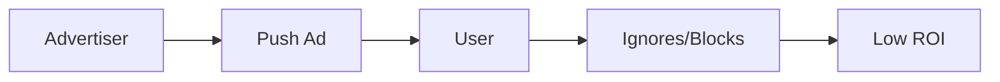
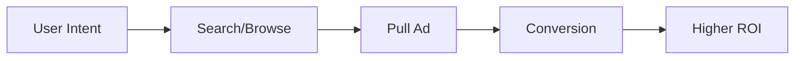
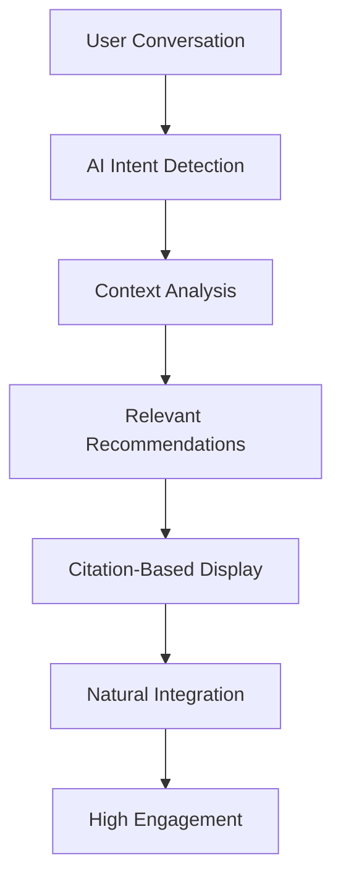

# AdMesh Ad Formats

Learn about AdMesh's unique approach to advertising through conversational, citation-based, and contextual ad formats that differ fundamentally from traditional push/pull advertising models.

## 🔄 Push vs Pull vs AdMesh's Contextual Model

### Traditional Push Advertising
**Definition**: Ads are forced upon users regardless of their current context or intent.

**Examples**:
- Banner ads on websites
- Pop-up advertisements
- TV commercials
- Social media sponsored posts

**Problems**:
- Interrupts user experience
- Often irrelevant to current context
- Creates ad fatigue
- Low engagement rates
- Users develop "banner blindness"



### Traditional Pull Advertising
**Definition**: Users actively seek out advertising content when they're ready to make a purchase.

**Examples**:
- Google search ads
- Product comparison sites
- Shopping platforms
- Review websites

**Problems**:
- Only captures users at bottom of funnel
- High competition and costs
- Misses discovery opportunities
- Limited to explicit search intent



### AdMesh's Contextual Intelligence Model
**Definition**: AI-powered recommendations that appear naturally within conversations and content when contextually relevant.

**Key Principles**:
- **Context-Aware**: Understands conversation flow and user intent
- **Non-Intrusive**: Appears as helpful suggestions, not ads
- **Intelligent Timing**: Shows recommendations at optimal moments
- **Citation-Based**: References products like academic sources
- **Value-First**: Provides genuine value before monetization



## 🎨 AdMesh Ad Formats

### 1. Citation-Based Recommendations

Display recommendations as numbered references within conversational text, similar to academic papers.

```tsx
import { AdMeshCitationUnit } from 'admesh-ui-sdk';

<AdMeshCitationUnit
  recommendations={recommendations}
  conversationText="For your startup's CRM needs, I recommend HubSpot for its excellent free tier and Salesforce for enterprise features..."
  citationStyle="numbered"
  showCitationList={true}
/>
```

**Output**:
```
For your startup's CRM needs, I recommend HubSpot¹ for its excellent 
free tier and Salesforce² for enterprise features...

References:
¹ HubSpot CRM - Free tier with excellent startup features
² Salesforce - Enterprise-grade CRM with advanced automation
```

### 2. Conversational Recommendations

Recommendations that appear naturally within chat interfaces and AI conversations.

```tsx
import { AdMeshConversationalUnit } from 'admesh-ui-sdk';

<AdMeshConversationalUnit
  recommendations={recommendations}
  config={{
    displayMode: 'inline',
    context: 'chat',
    maxRecommendations: 3,
    showPoweredBy: true
  }}
/>
```

### 3. Auto-Triggered Suggestions

Proactive recommendations that appear based on conversation context without explicit user requests.

```tsx
import { AdMeshAutoRecommendationWidget } from 'admesh-ui-sdk';

<AdMeshAutoRecommendationWidget
  recommendations={recommendations}
  trigger="User mentioned project management challenges"
  autoShow={true}
  position="bottom-right"
/>
```

### 4. Sidebar Recommendations

Persistent recommendation panels that complement main content without interrupting it.

```tsx
import { AdMeshSidebar } from 'admesh-ui-sdk';

<AdMeshSidebar
  recommendations={recommendations}
  config={{
    position: 'right',
    displayMode: 'recommendations',
    collapsible: true
  }}
/>
```

## 🧠 How AdMesh is Different

### Traditional Advertising Platforms

| Aspect | Traditional Push | Traditional Pull | AdMesh Contextual |
|--------|------------------|------------------|-------------------|
| **Timing** | Interrupts user flow | User-initiated only | Context-triggered |
| **Relevance** | Often irrelevant | High intent match | AI-determined relevance |
| **User Experience** | Disruptive | Expected | Enhancing |
| **Integration** | Separate from content | Search-based | Native to conversation |
| **Intelligence** | Rule-based targeting | Keyword matching | AI intent detection |
| **Format** | Banner/display ads | Search results | Citation references |

### AdMesh's Unique Advantages

#### 🎯 **Intent Detection Without Explicit Search**
```python
# Traditional: User must search "best CRM software"
# AdMesh: Detects intent from conversation

user_message = "I'm struggling to keep track of my customers"
# AdMesh AI detects CRM intent and suggests relevant tools
```

#### 📚 **Academic-Style Citations**
```
Traditional Ad: [🚨 BUY HUBSPOT NOW! 50% OFF! 🚨]

AdMesh Citation: "For customer management, consider HubSpot¹ 
for its user-friendly interface..."

¹ HubSpot CRM - Intuitive customer management platform
```

#### 🤖 **AI-Native Integration**
```tsx
// Seamlessly integrates with AI applications
function AIAssistant() {
  const handleUserQuery = async (query) => {
    const aiResponse = await getAIResponse(query);
    const recommendations = await getAdMeshRecommendations(query);
    
    return (
      <div>
        <AIResponse text={aiResponse} />
        <AdMeshCitations recommendations={recommendations} />
      </div>
    );
  };
}
```

#### 🔄 **Contextual Timing**
```javascript
// Shows recommendations at optimal moments
const shouldShowRecommendations = (conversationContext) => {
  return {
    afterProblemStatement: true,    // User describes a challenge
    beforeDecisionMaking: true,     // User weighing options
    duringResearch: true,           // User gathering information
    afterFailureStory: true         // User mentions tool limitations
  };
};
```

## 🎭 Visual Ad Format Showcase

### 📚 **Interactive Storybook Component Gallery**

See AdMesh ad formats in action through our interactive **Storybook** component showcase. This visual gallery demonstrates how ad formats are embedded and displayed in real applications.

#### **🌐 Access the Live Showcase**

**🔗 Hosted Storybook Options**:
- **GitHub Pages**: [https://gounimanikumar12.github.io/admesh-ui-sdk/storybook/](https://gounimanikumar12.github.io/admesh-ui-sdk/storybook/) *(deploying automatically)*
- **Quick Demo**: Use [Netlify Drop](https://app.netlify.com/drop) - drag the `storybook-static` folder for instant hosting

*No installation required - view all ad formats directly in your browser!*

:::tip GitHub Pages Deployment
✅ **TypeScript/ESLint issues fixed!** The GitHub Actions workflow is now running successfully.
🚀 **Deployment in progress** - The Storybook will be available at the GitHub Pages URL within 2-3 minutes.
📊 **Check status**: [GitHub Actions](https://github.com/GouniManikumar12/admesh-ui-sdk/actions)
:::

#### **💻 Local Development (Optional)**

For development and customization:

```bash
# Clone the UI SDK repository
git clone https://github.com/GouniManikumar12/admesh-ui-sdk.git
cd admesh-ui-sdk

# Install dependencies and start Storybook
npm install
npm run storybook
```

**Local URL**: `http://localhost:6006`

#### **🎨 Visual Ad Format Examples**

Navigate through these sections to see live ad format implementations:

##### **1. Citation Components** (`Citation/AdMeshCitationUnit`)
- **Numbered Citations**: ¹ ² ³ (clean circular style)
- **Bracketed Citations**: [1] [2] [3] (academic style)
- **Superscript Citations**: ¹ ² ³ (minimal footprint)
- **Dark/Light Themes**: Toggle between visual themes
- **Interactive Clicks**: See real tracking in browser console

##### **2. Storybook Ad Formats** (`AdMesh/Storybook Ad Formats`)
- **Business Narratives**: Complete stories with embedded citations
- **Developer Workflows**: Technical scenarios with tool recommendations
- **Format Comparisons**: Side-by-side traditional vs AdMesh displays
- **Performance Metrics**: Visual engagement rate demonstrations

##### **3. Conversational Showcase** (`Conversational/Showcase`)
- **Chat Interface Integration**: See how ads appear in AI conversations
- **Auto-Recommendations**: Context-triggered suggestion displays
- **Floating Chat Components**: Sidebar and overlay implementations

#### **🔍 What You'll See Visually**

1. **Live Citation Rendering** - Watch citations appear in real text
2. **Click Tracking Demo** - Console logs show tracking data
3. **Theme Switching** - Toggle between light/dark visual modes
4. **Responsive Design** - See mobile/desktop layout adaptations
5. **Hover Effects** - Interactive citation preview tooltips
6. **Real Product Data** - Actual recommendation cards with pricing/features

#### **🎯 Visual Benefits Demonstration**

The Storybook showcase visually demonstrates:

- **📈 Engagement Rates**: 8-12% vs 0.05% traditional CTR
- **🎨 Design Integration**: How citations blend naturally with content
- **📱 Responsive Layouts**: Mobile-friendly ad format adaptations
- **🔄 Real-time Tracking**: Live click and interaction monitoring
- **🎭 User Experience**: Smooth, non-intrusive recommendation flows

#### **💡 Try It Yourself**

1. **Visit Hosted Storybook**: [https://gounimanikumar12.github.io/admesh-ui-sdk/storybook/](https://gounimanikumar12.github.io/admesh-ui-sdk/storybook/)
2. **Navigate Components**: Explore different ad format categories in the sidebar
3. **Click Citations**: See tracking data in browser console (F12 → Console)
4. **Toggle Themes**: Switch between light/dark visual modes
5. **Test Responsiveness**: Resize browser to see mobile layouts
6. **Try Interactive Demos**: Click on citations to see real tracking in action

---

**Experience the visual difference**: AdMesh's citation-based ad formats enhance rather than interrupt content, creating a superior user experience while delivering better engagement rates. The Storybook showcase lets you see exactly how these formats integrate into real applications.
