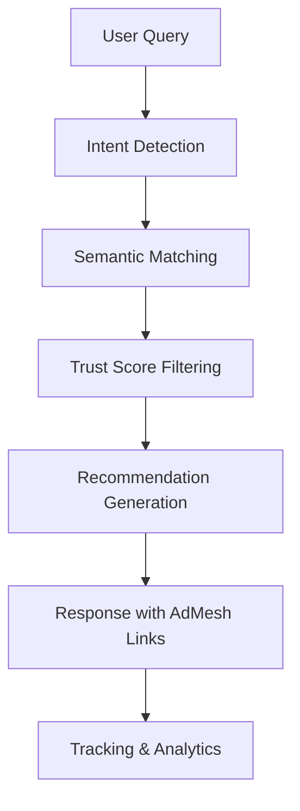

# Overview

Welcome to AdMesh! This guide will help you understand the core concepts and get started with integrating AI-powered product recommendations into your applications.

## What is AdMesh?

AdMesh is an intelligent recommendation engine designed specifically for AI applications, chatbots, and modern web experiences. It uses advanced machine learning to understand user intent and provide contextually relevant product suggestions.

## Core Concepts

### 🎯 Intent Detection
AdMesh automatically analyzes user queries to understand what they're looking for:

- **compare_products** - User wants to compare different options
- **best_for_use_case** - User needs recommendations for specific scenarios
- **trial_demo** - User is interested in trying products
- **budget_conscious** - User is price-sensitive

### 🔍 Semantic Matching
Our recommendation engine uses:
- **Text embeddings** with OpenAI's text-embedding-3-small model
- **Cosine similarity** for semantic matching
- **Trust scores** for quality filtering
- **Keyword matching** for precise targeting

### 📊 Recommendation Scoring
Each recommendation includes:
- **Intent match score** (0-1) - How well it matches the user's intent
- **Trust score** - Quality and reliability indicator
- **Reason** - AI-generated explanation for the recommendation

## Architecture Overview



## SDK Ecosystem

### Backend SDKs
- **Python SDK** - For AI applications, data processing, and backend services
- **TypeScript SDK** - For Node.js applications and serverless functions

### Frontend SDK
- **UI SDK** - React components for displaying recommendations with built-in tracking

## Integration Patterns

### 1. AI Assistant Integration
Perfect for chatbots and AI assistants that need to provide product recommendations:

```python
# Detect user intent and get recommendations
response = client.recommend.get_recommendations(
    query="I need a CRM for my startup",
    format="auto"
)

# Display recommendations in chat interface
for rec in response.response.recommendations:
    print(f"💡 {rec.title}: {rec.reason}")
```

### 2. E-commerce Integration
Enhance product discovery with AI-powered suggestions:

```typescript
// Get recommendations based on user behavior
const recommendations = await client.recommend.getRecommendations({
  query: userQuery,
  format: 'auto'
});

// Display using UI components
<AdMeshLayout recommendations={recommendations} />
```

### 3. Content-Based Integration
Add contextual product recommendations to articles and content:

```tsx
// Citation-based recommendations in content
<AdMeshCitationUnit
  recommendations={recommendations}
  conversationText="For project management, I recommend Asana..."
  citationStyle="numbered"
/>
```

## Key Features

### 🤖 AI-First Design
- Built specifically for AI applications
- Intelligent intent detection
- Contextual understanding
- Natural language processing

### 📱 Flexible UI Components
- Pre-built React components
- Citation-based conversation ads
- Floating chat widgets
- Sidebar components
- Auto-recommendation widgets

### 📊 Built-in Analytics
- Automatic view tracking
- Click-through monitoring
- Conversion attribution
- Revenue analytics

### 🎨 Customizable Theming
- Light and dark mode support
- Custom accent colors
- Responsive design
- Accessibility compliance

## Getting Started Checklist

- [ ] Create an account at [useadmesh.com/agent](https://useadmesh.com/agent)
- [ ] Get your API key from the dashboard
- [ ] Choose your SDK (Python, TypeScript, or UI)
- [ ] Install the SDK in your project
- [ ] Make your first API call
- [ ] Implement recommendation display
- [ ] Set up tracking and analytics

## Next Steps

1. **[Get your API key](/getting-started/api-keys)** - Set up authentication
2. **[Quick Start Guide](/getting-started/quick-start)** - Make your first API call
3. **Choose your SDK**:
   - [Python SDK](/python-sdk/installation) for backend applications
   - [TypeScript SDK](/typescript-sdk/installation) for Node.js applications
   - [UI SDK](/ui-sdk/installation) for React frontend components

## Common Use Cases

### AI Chatbots
Integrate product recommendations into conversational interfaces:
- Customer support bots
- Shopping assistants
- Business advisory bots

### E-commerce Platforms
Enhance product discovery and conversion:
- Product recommendation engines
- Search result enhancement
- Personalized shopping experiences

### Content Platforms
Add contextual product suggestions:
- Blog post recommendations
- Tutorial tool suggestions
- Review site integrations

### SaaS Applications
Help users discover relevant tools:
- Workflow optimization suggestions
- Integration recommendations
- Feature discovery

---

Ready to start building? Let's [get your API key](/getting-started/api-keys) and make your first recommendation request!
